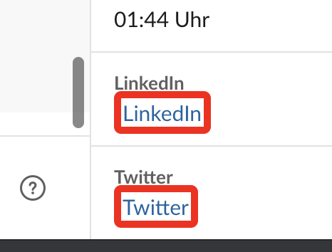
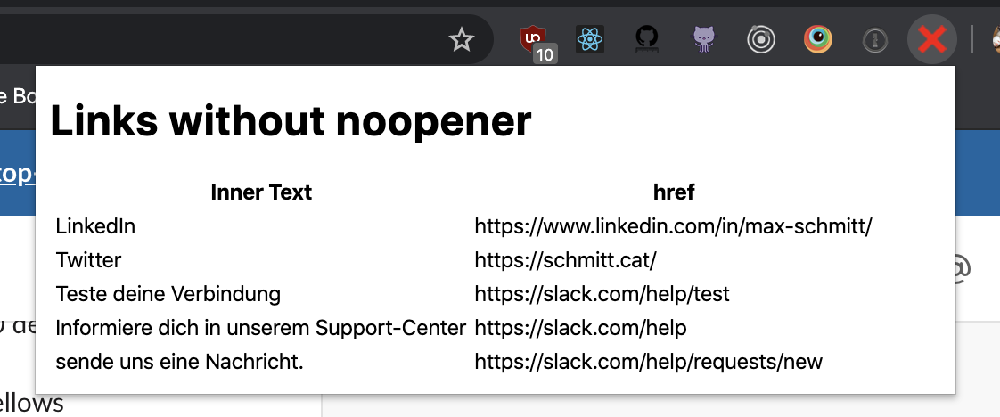

# Chrome extension to detect links with target=_blank and missing rel=noopener

> Find links which lead to external pages without a noopener directly once you are browsing the web

## Features

- Find the links on the page in a table once you click on the extension icon with their href and title
- Findings will be surrounded by a red border, so you you see directly where they are

## Example

Here you see how findings will look like:

And here how they will be captured in the popup window.

Also the icon will change from an positive to a negative one once if there are findings on the page. It will check for DOM updates every second.

## Helpful articles

- [About the vulnerability](https://mathiasbynens.github.io/rel-noopener/)
- [Target="_blank" - the most underestimated vulnerability ever](https://www.jitbit.com/alexblog/256-targetblank---the-most-underestimated-vulnerability-ever/)
